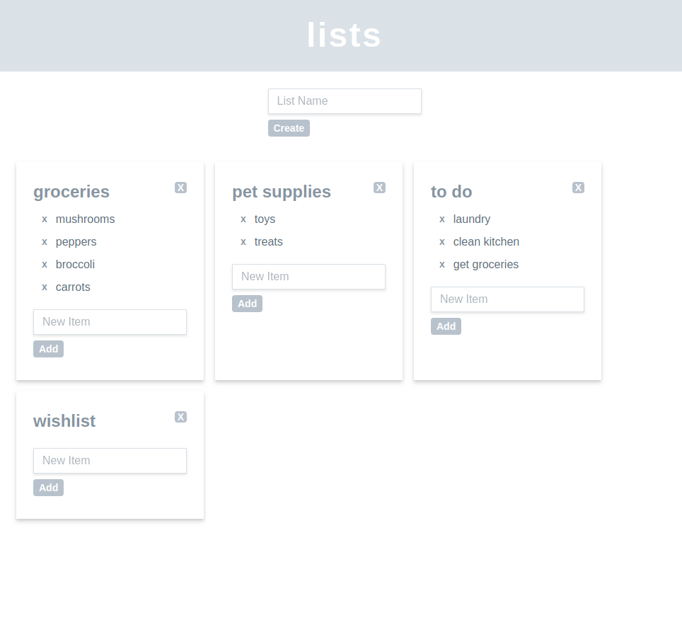

# Lists
Lists is a minimal web application that allows you to create, edit, and delete your own lists all in one simple page.

## Setup

    $ bundle install

    $ bundle exec hanami db prepare

    $ bundle exec hanami server

Lasty, go to http://localhost:2300

## Screenshot

